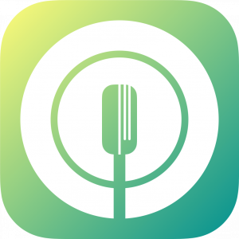
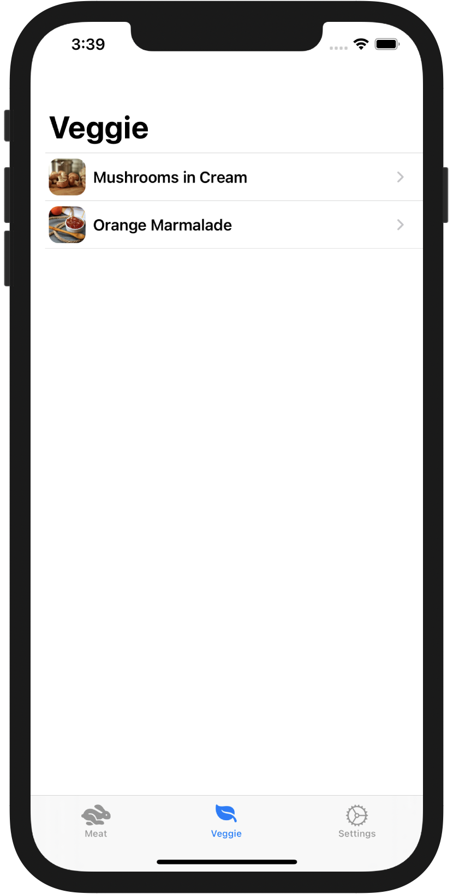
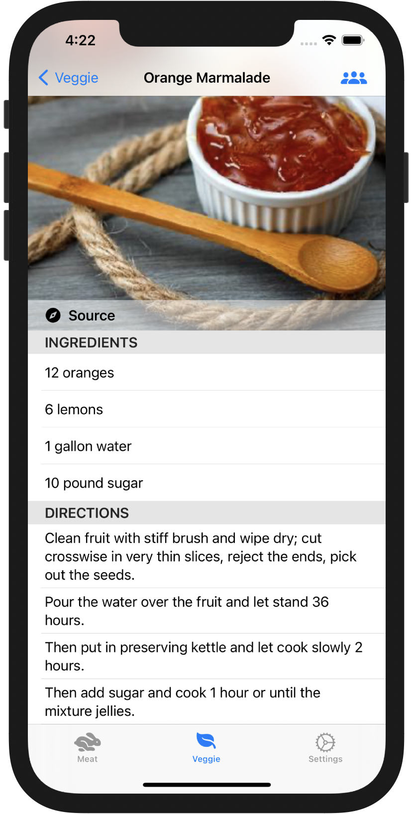
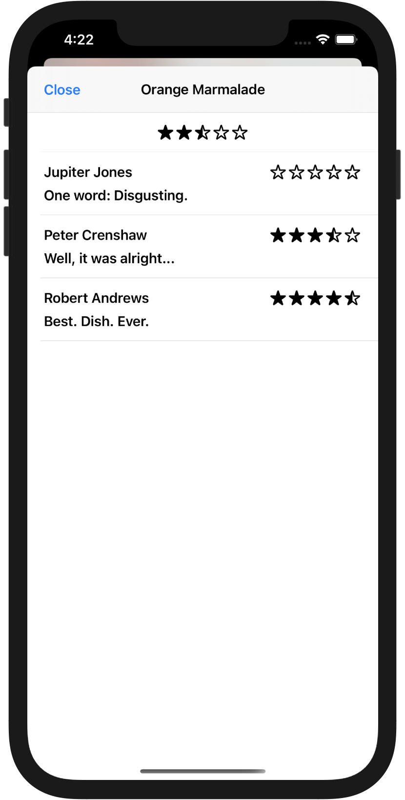

  

# SwiftUI Coordinators Example

This example app is part of our blog article [How to Use the Coordinator Pattern in SwiftUI](https://quickbirdstudios.com/blog/coordinator-pattern-in-swiftui/). While the article introduces the different techniques and components of our approach to the Coordinator Pattern in SwiftUI on a general level, the Recipes App acts as a demonstration and can be used as a starting point to experimenting with it.

In a follow-up article [Navigation and Deep-Links in SwiftUI](https://quickbirdstudios.com/blog/swiftui-navigation-deep-links/), we have further adapted the example app to use the [XUI library](https://github.com/quickbirdstudios/XUI). These adaptions can be found on the [xui branch](https://github.com/quickbirdstudios/SwiftUI-Coordinators-Example/tree/xui).
## Recipes App

The Recipes App lists different recipes with instructions on how to prepare it and ratings from previous users having tried it. In its current form, the app does not provide this functionality, but rather displays mock data.

  
  
  

The `HomeCoordinatorView` and its view model `HomeCoordinator` coordinate the `TabView` and create optional sheets. The `RecipeListCoordinatorView` and `RecipeListCoordinator` coordinate the list of recipes, displaying a detail screen for a selected recipe and showing ratings of the selected recipe.

## Author

This example app and the blog article were created with ❤️ by [QuickBird Studios](https://quickbirdstudios.com).

## License

The Recipes App is released under the MIT license. See [LICENSE](LICENSE) for more information.

